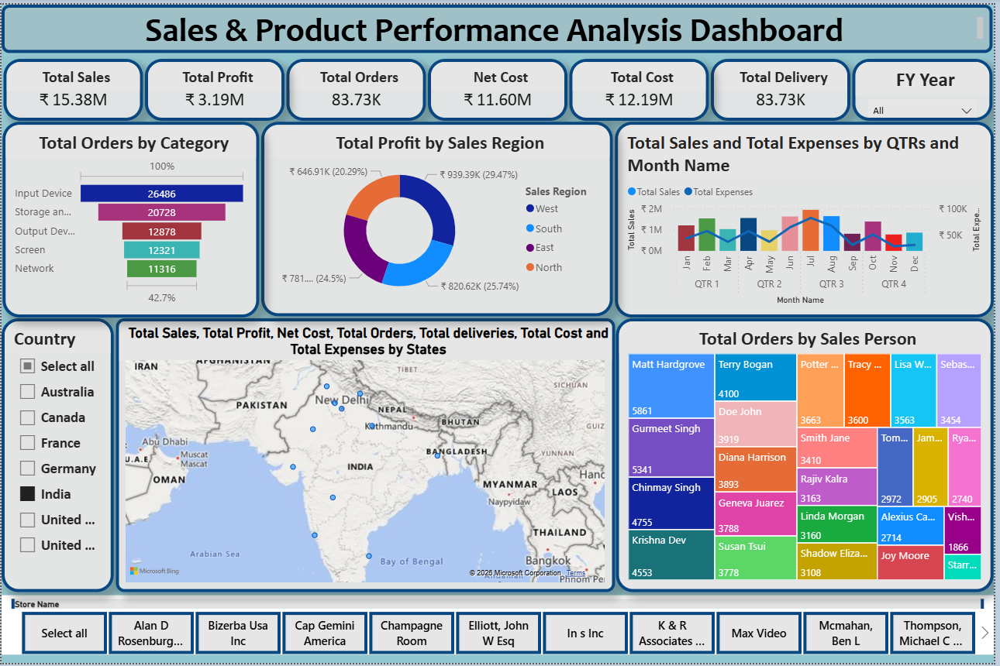
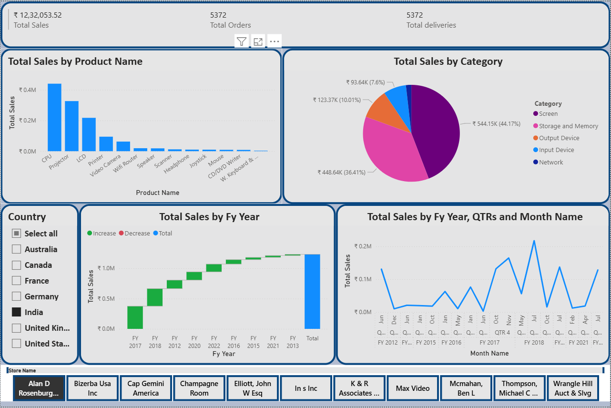
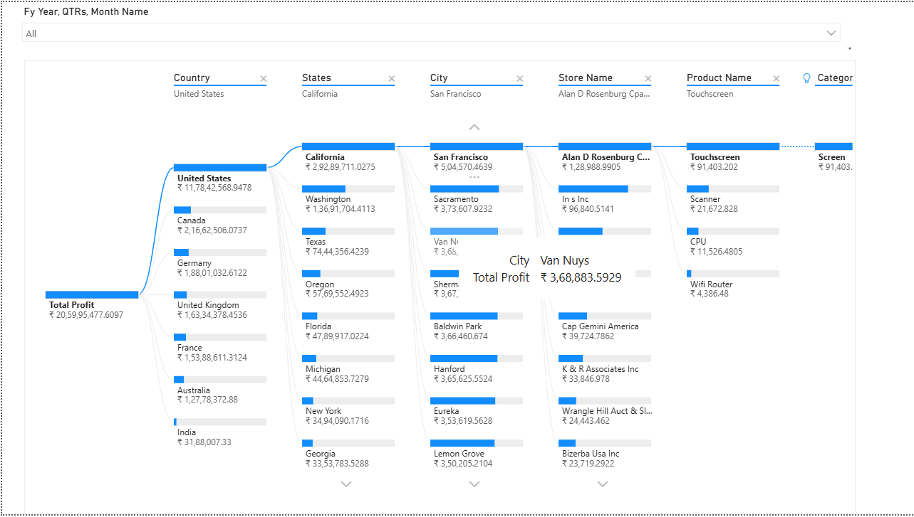
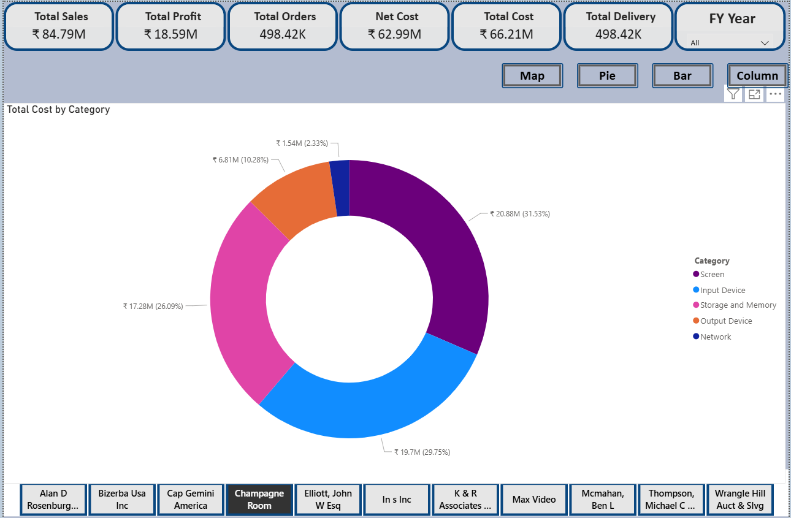

# 📊 Sales-Product-Performance-Analysis-PowerBI
# 
## 📑 Table of Contents
- [Project Overview](#-project-overview)
- [Objectives](#-objectives)
- [Time Period Covered](#-time-period-covered)
- [Key KPIs](#-key-kpis)
- [Dashboard Insights](#-dashboard-insights)
  - [Orders by Product Category](#-orders-by-product-category)
  - [Profit by Sales Region](#-profit-by-sales-region)
  - [Sales vs Expenses Analysis](#-sales-vs-expenses-analysis)
  - [Orders by Sales Person](#-orders-by-sales-person)
  - [Geographic Performance](#-geographic-performance)
- [Dashboard Preview](#-dashboard-preview)
- [Tools & Technologies Used](#-tools--technologies-used)
- [Data Sources](#-data-sources)

- [Business Value](#-business-value)
- [Author](#-author)
- [Support](#-support)

## 🧾 Project Overview
This project showcases an interactive **Power BI dashboard** built to analyze **Sales, Profit, Cost, Orders, Deliveries, and Product Performance** across multiple business dimensions.

The dashboard helps stakeholders gain **actionable insights**, track KPIs, identify trends, and support **data-driven decision-making**.

---

## 🎯 Objectives
- Analyze overall **sales and profit performance**
- Monitor **orders and deliveries** by product category
- Compare **sales vs expenses** monthly and quarterly
- Identify **top-performing regions and salespersons**
- Track **state-wise and country-wise performance**

---

## 📅 Time Period Covered
- **Financial Years:** 2012 – 2022

---

## 📌 Key KPIs
- **Total Sales:** ₹15.38M  
- **Total Profit:** ₹3.19M  
- **Total Orders:** 83.73K  
- **Total Deliveries:** 83.73K  
- **Net Cost:** ₹11.60M  
- **Total Cost:** ₹12.19M  

---

## 📊 Dashboard Insights

### 🔹 Orders by Product Category
- Input Devices  
- Storage & Memory  
- Output Devices  
- Screen  
- Network  

➡ Helps identify high-demand product categories

---

### 🔹 Profit by Sales Region
- West  
- South  
- East  
- North  

➡ Highlights regional contribution to total profit

---

### 🔹 Sales vs Expenses Analysis
- Monthly and Quarterly comparison  
- Identifies seasonal sales and expense trends

---

### 🔹 Orders by Sales Person
- Tree Map visualization
- Highlights top-performing sales representatives

---

### 🔹 Geographic Performance
- Country-wise and State-wise analysis
- Interactive map for deeper regional insights

---

## 🛠 Tools & Technologies Used
- **Power BI Desktop**
- **Microsoft Excel**
- **Power Query**
- **DAX**
- **Data Modeling & Visualization**

---

## 🧩 Data Sources
- Sales Records (2012–2022)
- Product Details
- Product Sold & Produced Data
- Employee & Other Business Details

---

## 📷 Dashboard Preview

### 🔹 Overall Sales & KPI Overview

### 🔹 Sales & Expenses Analysis

### 🔹 Profit by Sales Region

### 🔹 Salesperson Performance

---

s

---

## 📈 Business Value
- Enables real-time performance monitoring
- Improves sales and cost optimization
- Helps identify growth opportunities
- Supports strategic planning

---

## 👤 Author
**Abhishek Kumar**  
Aspiring Data Analyst  

🔗 GitHub: https://github.com/abhishekdu430  
🔗 LinkedIn: https://www.linkedin.com/in/abhishekkumar430  

---

## ⭐ Support
If you like this project, don’t forget to **star ⭐ the repository**.
